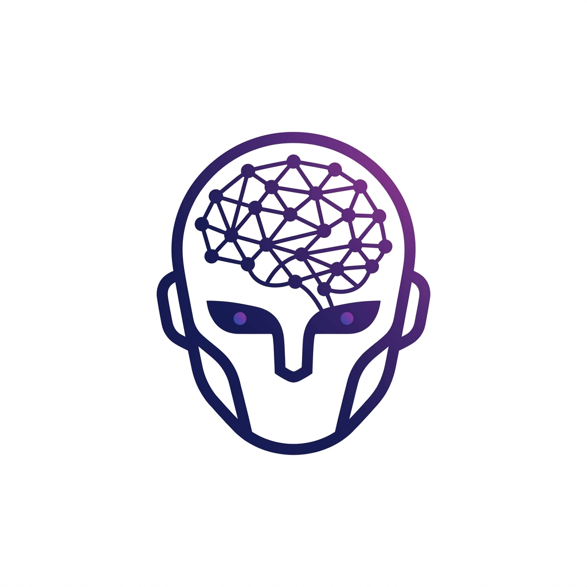

<p align="center">
  
  <h1 align="center">Slimbot</h1>
  <p align="center">
    <strong>An Autonomous, Self-Evolving AI Assistant</strong><br>
    <em>v0.1.0-beta • Lightweight • Extensible • Multimodal</em><br>
    
  </p>
</p>

#

Slimbot is not just another chatbot. It's a personal AI agent built with PHP that can **write its own skills**, manage its own long-term memory, and interact with the world through a sleek, modern interface.

> [!CAUTION]
> **Experimental Project**: Slimbot is currently in an early development stage (**v0.1.0-beta**). It is designed for **personal, local-only testing**. It does not yet include the security features (like multi-user authentication or production-grade sandboxing) required for deployment on a public-facing server. **Doing so may expose your personal files, API keys, and conversation history.**

## 🚀 Key Features

- **🧠 Self-Writing Skills**: Can learn new behaviors and response styles by writing and auto-reloading its own `SKILL.md` files.
- **💾 Advanced Memory System**: Categorized facts and notes that persist across sessions. Intelligent auto-loading of facts into the system prompt.
- **🎨 Premium UI**: A stunning Glassmorphism-inspired chat interface with markdown support, code syntax highlighting, and localized labels.
- **🔌 Multi-Provider Support**: Seamlessly switch between **OpenAI, Google Gemini, Claude**, and local **Ollama** models.
- **🛠️ Tool Chaining**: Autonomous capability to chain multiple tools (filesystem, web search, vision) to achieve complex goals.
- **📸 Multimodal Native**: Built-in support for DALL-E 3, Whisper (Speech-to-Text), and OpenAI TTS.

## 🛠️ Setup

1. **Install Dependencies**
   ```bash
   composer install
   ```

2. **Configuration**
   ```bash
   cp .env.example .env
   # Add your API keys and select provider
   ```

3. **Launch Agent Server**
   ```bash
   php index.php server 8080
   ```

4. **Launch Web UI**
   ```bash
   php -S 127.0.0.1:8000 -t public
   ```
   Open `http://127.0.0.1:8000` to start chatting!

## 📁 Project Structure

- `src/` - Core logic, agents, and tool implementations.
- `public/` - The modern web dashboard.
- `workspace/` - Your agent's brain (history, memory, skills).
- `workspace/skills/` - Custom behavioral instructions.

## 📝 License
MIT

---
*This project was **90% written by AI** (collaborating with a human developer).*
